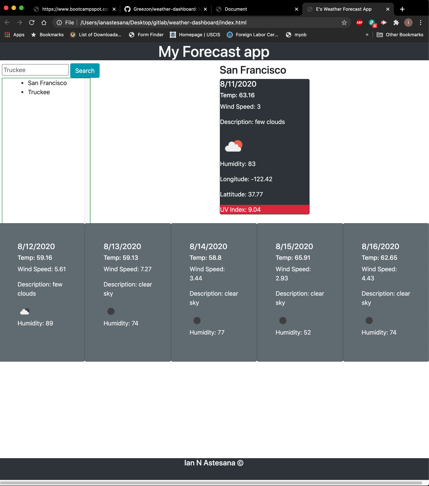

# weather-dashboard

## I am an avid snowboarder, it seemed only proper that I make something that I can check the weather with!

### Jquery
This is the first time I have ever really put my jquery skills to the test. I really did need to use ever single resource I had to complete this project.
### APIs
I learned how to use apis, get keys, and pull data from the APIS.
### Local storage
The local storage has been a real challange for me. In this project I utulized the search history, and implemented onclick functions embeded into the list items in my Javascript file. It was fun, and time consuming learning how to get that to work.

https://greezon.github.io/weather-dashboard/

## Contributing
Pull requests are welcome. I will not be reviewing any changes from any unknown source.

## License
[MIT](https://choosealicense.com/licenses/mit/)
